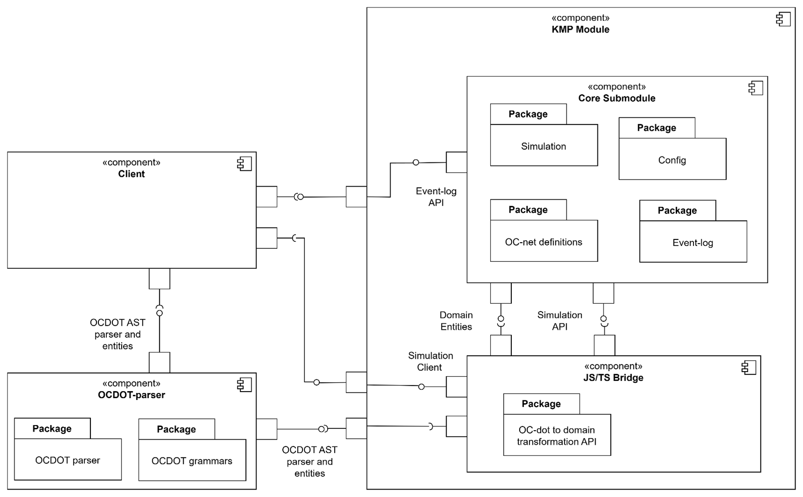
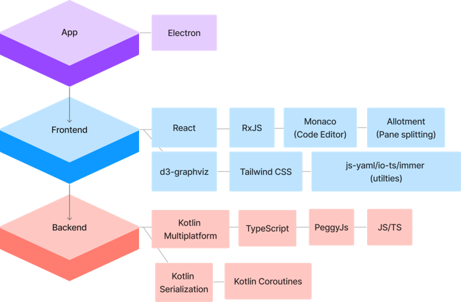

# Developer Guide
{: .no_toc }

{: .construction }
> Section is under construction. All latest releases can be found at the [repository](https://github.com/MisterPotz/ocgena).

Guidelines and resources for developers interested in contributing to the OCGENA project or integrating it as a plugin into their existing algorithms.

1. TOC 
{:toc }

## Architecture Overview
OCGENA has 4 main modules:

1. **Core module** (Common Kotlin KMP module): core (domain) definitions for OC-net and simulation algorithm.
2. **JS Bridge module** (JS Kotlin KMP module): exposes core module's functionality to JS/TS clients to consume.
3. **OCDOT parser** module: uses OCDOT grammars and PeggyJS to provide OCDOT parser to clients.
4. **Client** module: uses variety of open-source software to deliver user-friendly environment to work with OC-nets in.

{: .text-center }
_OCGENA's architecture_

## Technology stack
OCGENA leverages a rich combination of different technologies.
- **Kotlin Multiplatform** is at core of the application. It allows to compile the simulation algorithm to Java in future, would it become necessary for the project, or it can be compiled as Javascript, and be consumed by Javascript clients. 
- Making use of **Monaco Editor** enables user-friendly and smooth experience for editing configuration and model files.
- **Tailwind CSS** simplifies stylization and makes the codebase more clean and maintainable. 
- **React** and **RxJs** make the application more responsive to user actions. 
- **Electron** merges it all, and packages as a nice single-file application.

{: .text-center }
_OCGENA's Technology stack_
