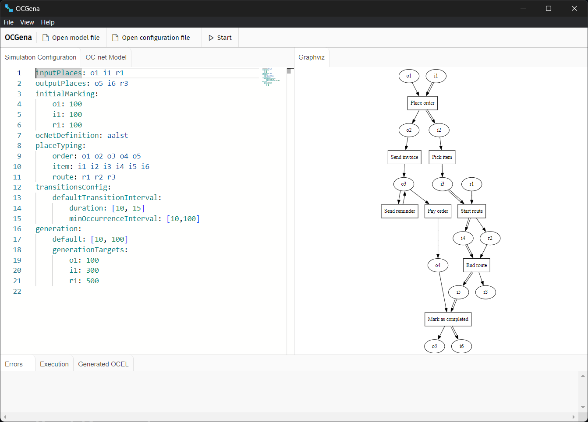
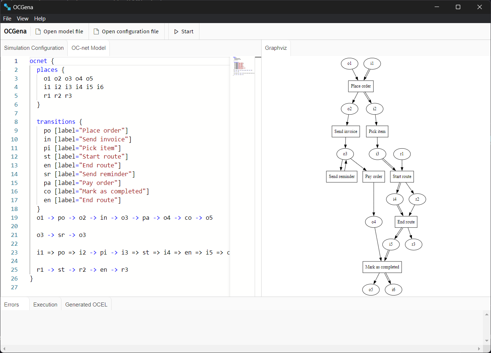

# Boost Your Research with OCGENA
{: .fs-9 }
Simplify the study of intricate business processes and the generation of object-centric event logs for a smoother research experience.
{: .fs-6 .fw-300 }

{: .note }
> OCGENA is under development and is planned to have more features. All latest releases can be found at the [repository](https://github.com/MisterPotz/ocgena).

Welcome!

**OCGENA** is a tool designed to simulate Object-Centric Petri nets, which enables these use cases:
1. Business process designers can model their processes in the new OC-net notation and run simulations
2. Researchers can generate object-centric event-logs to evaluate new object-centric process mining algorithms.

Here you will find comprehensive information about the tool, its features, and how to use it.

## Features
- Simulation of Object-Centric Petri Nets
- Generation of event-logs which can be used to evaluate Object-Centric process-mining algorithms
- Definition of Object-Centric Petri Nets with DSL based on DOT (OCDOT) in embedded user-friendly editor
- Auto-rendering of OC-net as you type
- Configuration of simulations with YAML files
- Embedded editor support for configuration files with auto-completion of available parameters
- Auto-reporting of any configuration/model consistency errors
- Standard text editor features for saving and opening configuration and model files

## Screenshots

{: .text-center }
_User Interface of OCGENA_

{: .text-center}
_Definition of OC-net in OCDOT_

## About

This project was done by *Alexander S. Gornostaev* as coursework on topic "Object-Centric Petri Net Simulator" at the Higher School of Economics with the help of the PAIS Lab.
The project supervisor is *Alexey A. Mitsyuk*.
