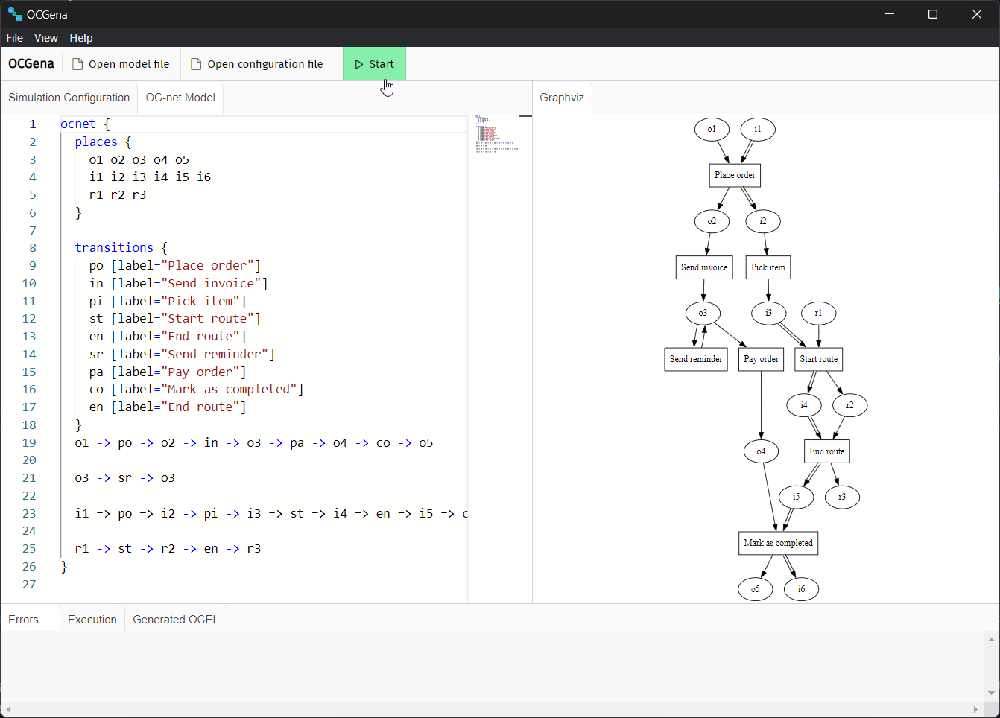
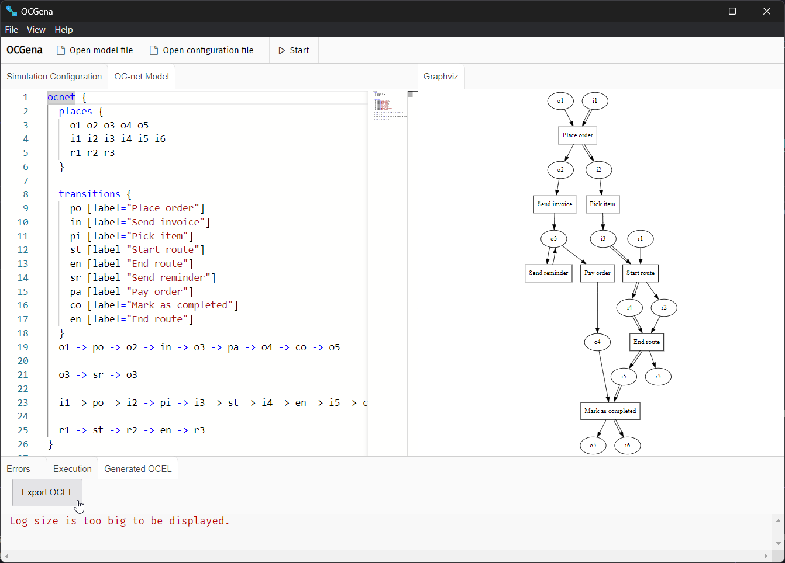

# User Guide
{: .no_toc }

{: .construction }
> Section is under construction. All latest releases can be found at the [repository](https://github.com/MisterPotz/ocgena).

A detailed guide to help users understand and effectively use the OCGENA tool.

1. TOC 
{:toc }

## Prerequisites
The application is built as Electron application. Currently, there are sources for Windows platform. If you have different platform, you can build the binaries yourself (see [Developer guide](./developer_guide.html))

## Getting Started

### Installation 
To install the application, you can find the version for your platform in [**Releases**](https://github.com/MisterPotz/ocgena/releases) section of the repository. Download the version you need, and launch the installer.

### First simulation
The application uses example model by default. You can try how the application works with this example. Simply click the "Start" button in the upper part of the application UI.

{: .text-center}
_Click the "Start" button in the upper part._

### Exporting OCEL
You can click through "Execution" and "Generated OCEL" tabs to get the understanding of what these tabs are about. 

Basically, "Execution" contains the trace logs of how simulation run. "Generated OCEL" tab is the destination you may want to visit to export the OCEL log, which you can then view in software like "OCPM".

{: .text-center}
_"Export" button in "Generated OCEL" tab_

<!-- ## Understanding the User Interface 

## Configuring a Simulation

## Understanding the Simulation Output

## Using the OCNet Model -->